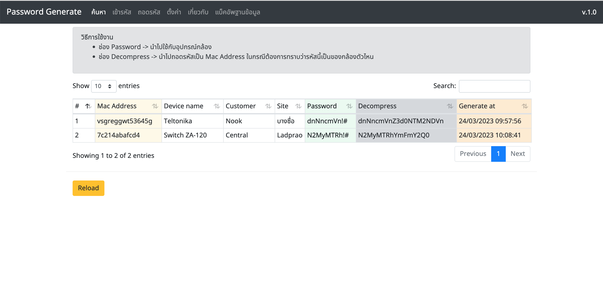
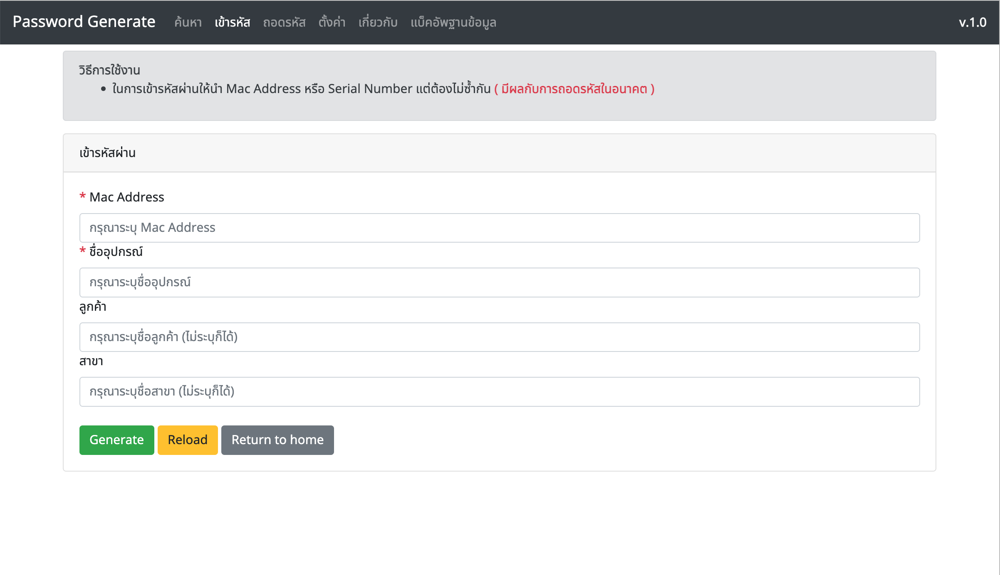
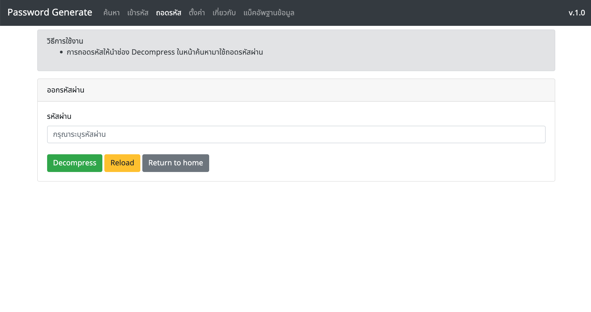
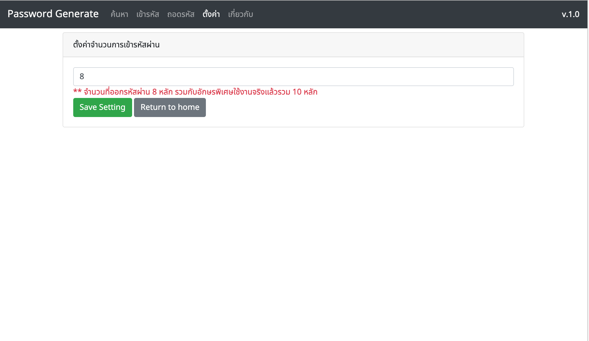
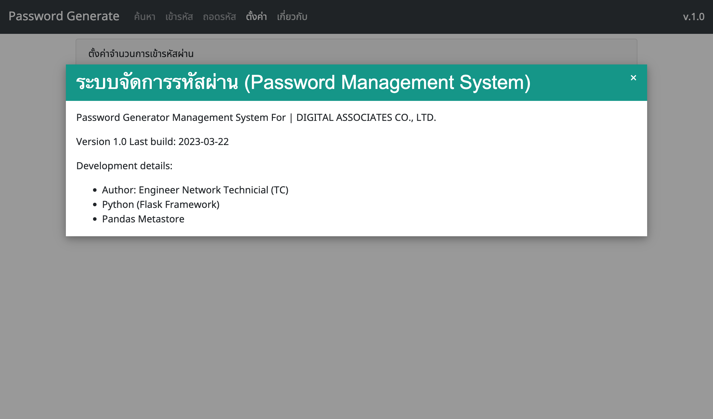

# โปรแกรมบริหารจัดการรหัสผ่านอุปกรณ์เน็ตเวิร์คภายในองค์กร


> ## เครื่องมือที่ใช้ในการพัฒนา
* Back-End
  * Python (Flask Framework)
* Front-End
  * Bootstrap, jQuery
* Database
  * SQLite3

---

> ## คุณสมบัติโปรแกรม

* สามารถใช้ Mac Address หรือ Serial Number ในการเข้ารหัส (ไม่น้อยกว่า 10 ตัว) <b>แนะนำเป็น Mac Address</b> <b style="color: red;">** ต้องมั่นใจว่าข้อมูลที่นำมาเข้ารหัสไม่ซ้ำกัน (UNIQUE)</b>
* สามารถเข้า-ถอดรหัสได้ (Encypt, Decypt)
* สามารถเพิ่มรายละเอียดได้ เช่น ชื่ออุปกรณ์, ลูกค้า, สาขา, ชื่ออุปกรณ์
* ค้นหารหัสผ่านและที่เคยเข้ารหัสไปแล้วได้
* เก็บลงฐานข้อมูลได้ไม่จำกัด
* สามารถกำหนดจำนวนของรหัสผ่านได้เองผ่านหน้า UI
* สามารถแบ็คอัพ Database ได้

> ## วิธีการติดตั้ง
> ### ติดตั้ง Anaconda ได้จากลิ้งนี้

* Windows: [Download](https://repo.anaconda.com/archive/Anaconda3-2023.03-Windows-x86_64.exe)
* Linux: [Download](https://repo.anaconda.com/archive/Anaconda3-2023.03-Linux-x86_64.sh)
* macOS [Download](https://repo.anaconda.com/archive/Anaconda3-2023.03-MacOSX-x86_64.pkg)

> ### Download ตัวโปรเจ็ค

```bash
git clone https://github.com/ezynook/Password-Manager.git
```

> ### เปลี่ยนชื่อ Directory

```bash
mv Password-Manager genpassword
```

> ### เข้าไปยังตัวโปรเจ็ค

```bash
cd genpassword
```
> ### ติดตั้ง Python Library ที่ต้องใช้กับโปรเจ็ค

```bash
pip install flask
pip install db-sqlite3
pip install pysqlite3
pip install pandas
pip install sqlalchemy
pip install ConfigParser
#Default Environment
export FLASK_APP=genpassword
export FLASK_ENV=development
```

> ### ตั้งค่า IP และ Port ตามต้องการ
```bash
vim app.cfg
[DEFAULT]
HOST = 0.0.0.0 #ถ้าต้องการให้เข้าได้จากทุก  เครื่องให้ใช้ 0.0.0.0
PORT = 9000 #เปลี่ยน Port ได้ตามต้องการ
```
> ### Run Project
```bash
python app.py
```
> ### หาก Run ผ่านจะขึ้นประมาณนี้
```bash
* Serving Flask app 'app'
* Debug mode: on
* Running on all addresses (0.0.0.0)
* Running on http://127.0.0.1:9000
* Running on http://192.168.40.22:9000
Press CTRL+C to quit
* Restarting with watchdog (fsevents)
* Debugger is active!
* Debugger PIN: 135-649-652
```
> ### จากนั้นเข้าผ่าน Browser
```bash
http://your_ip_address:port/
```
---
> ### ตัวอย่างหน้าจอค้นหารหัสผ่าน


> ### ตัวอย่างหน้าจอเข้ารหัสผ่าน


> ### ตัวอย่างหน้าจอถอดรหัสผ่าน


> ### ตัวอย่างหน้าจอการตั้งค่าจำนวนรหัสผ่านที่ต้องการ


> ### ตัวอย่างหน้าจอรายละเอียดโปรแกรม


---

> Develope by <b>Pasit Y.</b>